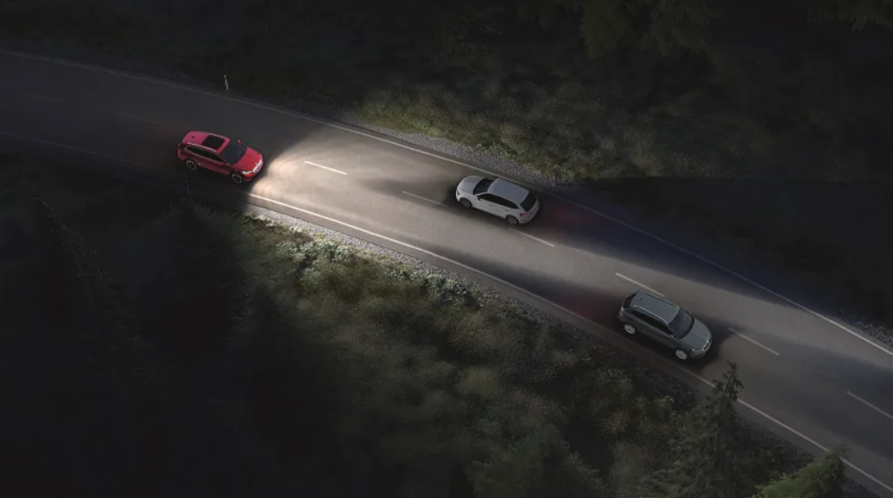
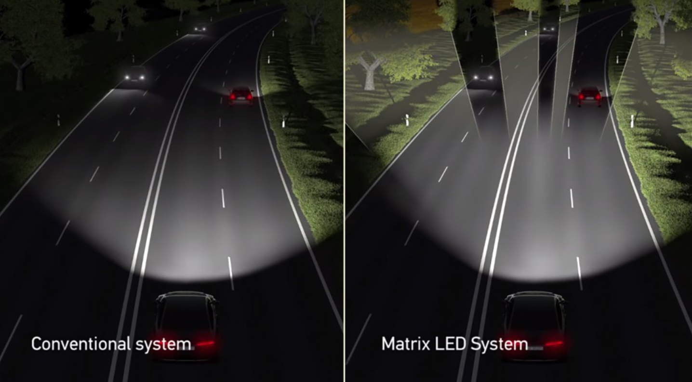

---

# Adaptive LED Matrix 💡

Adaptive LED Matrix is a proof-of-concept project inspired by Audi’s adaptive headlights. It offers a smart, cost-effective solution for better driving safety by adjusting an LED display in real time based on what it sees on the road. a system  not only adapts your headlights to reduce glare but also shows important signals—making driving easier and safer in busy traffic.. This repository is organized into two phases:

- **Phase 1: Software Simulation**  
  Simulate adaptive LED behavior using YOLOv7 for real-time object detection and OpenCV for LED matrix visualization.

- **Phase 2: Hardware Integration (Work in Progress)**  
  Integrate the simulation with actual hardware components, such as MAX7219 LED modules and a Raspberry Pi Camera Board Version 2 (Sony IMX219 sensor).

---
## Table of Contents

- [Project Overview](#project-overview)
- [Features and Options](#features-and-options)
- [Repository Structure](#repository-structure)
- [Installation and Setup](#installation-and-setup)
- [Usage](#usage)
- [Sample Video Outputs](#sample-video-outputs)
- [Challenges and Solutions](#challenges-and-solutions)
- [Camera and Hardware Details](#camera-and-hardware-details)
- [Hardware Connections and Debugging](#Hardware-Connections)
- [output](#output)
- [External Links and Resources](#external-links-and-resources)
- [Future Enhancements](#future-enhancements)
- [License](#license)
- [Contributing](#contributing)
- [Contact](#contact)

---

## Project Overview

The Adaptive LED Matrix project simulates a dynamic lighting system that responds to vehicles detected in a video stream. By using YOLOv7, the system maps the detected vehicle positions to specific LED slots on an 8×8 matrix. In Phase 1, the entire process is simulated in software—laying the foundation for eventual hardware integration (Phase 2).
<p align="center">
  
</p>
 
<p align="center">
  
</p>

---

## Features and Options

### Detection Options
- **Input Source:**  
  The system accepts either a video file or a live camera feed.  
  - **Video:** For example, use `data/test_videos/cars_video.mp4`.  
  - **Live Camera:** Set `source = 0` (or integrate with libraries like `picamera2`).

- **Image Size (`img_size`):**  
  Controls the resolution provided to YOLOv7. Lower resolutions (e.g., 320) offer faster inference at a potential cost in detection accuracy.

- **Thresholds:**  
  - **Confidence (`conf_thres`):** Minimum confidence level for a detection to be considered.  
  - **IoU (`iou_thres`):** Intersection over Union threshold used in Non-Max Suppression to remove overlapping detections.

### LED Matrix Simulation Options
- **Matrix Layout:**  
  The 8×8 LED matrix is simulated as two modules:
  - **Left Module:** Columns 0–3.
  - **Right Module:** Columns 4–7.

- **Dynamic LED Control:**  
  For each frame, the system determines which LED slots should be turned off based on the position of detected vehicles. If multiple vehicles are detected on the same side, all corresponding slots are updated in real time.

### YOLOv7 and ONNX
- **YOLOv7:**  
  Chosen for its high accuracy and real-time detection performance.
- **ONNX (Future Option):**  
  Although the current implementation uses PyTorch, converting the model to ONNX is planned to enable faster inference and broader device compatibility.

### Camera Resolution Options
The Raspberry Pi Camera Board Version 2 supports multiple resolutions:
- **1080p at 30 FPS (Full HD)**
- **720p at 60 FPS (HD)**
- **640×480 at 90 FPS (VGA)**

These options help balance image quality and processing speed.

---

## Repository Structure
```
Adaptive-LED-Matrix/
├── data/
│   ├── test_images/         # Images for debugging and testing object detection
│   └── test_videos/         # Sample videos used for simulation (e.g., cars_video.mp4, realv.mp4, highway.mp4)
├── docs/
│   ├── 00000.png               # which is used in repo
│   └── problems_solutions.md  # Documentation of encountered issues and their solutions , 0 phase which is commented 
├── models/                  # YOLOv7 model files and ONNX export scripts
├── screen/
│   ├── yolo7.png            #yolo7 is downloaded
│   ├── shiftToraspb.png     # from pc to raspb
|   ├── downloadvid.png      # out put of script/Download_YoutubeVid.py
├── src/
│   ├── main.py              # Main script for running the simulation
│   ├── detection.py         # Object detection and video processing using YOLOv7
│   ├── led_control.py       # LED matrix simulation/control logic
│   └── utils_custom.py      # Utility functions (model loading, image preprocessing)
├── scripts/
|   ├── Download_YoutubeVid.py
├── Test/
│   ├── camera_test.py       # Testing camera integration and object detection
│   ├── test_ledmatrix.py    # Testing LED matrix control logic
│   └── spidev-test.py       # Testing SPI communication for hardware control
├── requirements.txt         # Python dependencies (e.g., torch, opencv-python, numpy)
├── README.md                # Project documentation
└── LICENSE    
```
### data Link

Access data folder via the following Google Drive folder:

[Data](https://drive.google.com/drive/folders/1CEXMNom0yxXcvw-b2lsECXVmUIV8u60k?usp=drive_link)

---

## Installation and Setup

1. **Clone the Repository:**

   ```bash
   git clone https://github.com/omnia/Adaptive-LED-Matrix.git
   cd Adaptive-LED-Matrix
   ```

2. **Install Dependencies for Phase 1:**

   Navigate to the Phase 1 folder:

   ```bash
   cd src
   pip install -r requirements.txt
   ```

   _Note: Ensure you are using a compatible Python version (e.g., Python 3.8 – 3.11). If you experience version conflicts (e.g., NumPy requirements), adjust the dependency versions in `requirements.txt` accordingly._

3. **(Phase 2)**  
   Additional dependencies for hardware control will be included in `phase2/requirements.txt` as development progresses.

---

## Usage

To run the simulation for Phase 1, execute the main script:

```bash
python3 src/main.py #--weights yolov7-tiny.pt --source "data/test_videos/cars_video.mp4" --img-size 640 --conf-thres 0.5 --iou-thres 0.5 --device cpu --view-img

```
---

## Sample Video Outputs

The system processes multiple video sources and updates the LED matrix in real time. For instance:

1. **Urban Roads:**  
   The system detects vehicles and dynamically disables LED slots to simulate adaptive headlight patterns in a city setting.  
   [🎥 Watch urban.mp4](docs/urban.mp4)

2. **Highway Traffic:**  
   With a higher FPS input, the system smoothly updates the LED matrix even at high speeds.  
   [🎥 Watch Highway.mp4](docs/Highway.mp4)

3. **Controlled Test Scenario:**  
   A controlled video feed used to test different resolutions and LED mapping strategies.  
   [🎥 Watch Countryside.mp4](docs/Countryside.mp4)

Video outputs are available in the `docs/` folder.

---

## Challenges and Solutions

### Version Conflicts
- **Problem:**  
  Incompatibilities between certain versions of NumPy, Python, and ONNX.
- **Solution:**  
  Specify compatible versions (e.g., `numpy>=1.18.5,<1.24.0`) in `requirements.txt` and consult the YOLOv7 repository for recommendations.

### Model Export and Integration
- **Problem:**  
  Converting YOLOv7 models to ONNX for deployment can be challenging.
- **Solution:**  
  Use YOLOv7’s export scripts (e.g., `export.py`) and test with ONNX Runtime to ensure proper conversion.

### Hardware Component Choices
- **MAX7219 Module 4-in-1 8X8 LED Matrix Module:**  
  Selected for its simplicity and cost-effectiveness in controlling an 8×8 LED array.
- **Raspberry Pi Camera Board V2:**  
  Provides versatile resolution options to balance between quality and performance.

---

## Camera and Hardware Details
- **Raspberry Pi 4**
  [Product Link](https://www.amazon.eg/-/en/Xute-Raspberry-4GB-Cortex-A72-Bluetooth/dp/B0C7KXMP7W/ref=asc_df_B0C7KXMP7W/?tag=egoshpadde-21&linkCode=df0&hvadid=725192583796&hvpos=&hvnetw=g&hvrand=8937843028174914309&hvpone=&hvptwo=&hvqmt=&hvdev=c&hvdvcmdl=&hvlocint=&hvlocphy=9218366&hvtargid=pla-2223870482804&mcid=ee88c1e71fac3b13ba66ee8b066c4386&language=en_AE&gad_source=1&th=1)

- **Raspberry Pi Camera Board Version 2**  
 [Product Link](https://makerselectronics.com/product/raspberry-pi-camera-board-version-2-sony-imx219-8-megapixel-sensor?srsltid=AfmBOops-2ER_4kj-9x-s9uZMQzArf3JvOZPqDYmQLbiWg1jf0ydw9vr)  
  - Supports 1080p @ 30 FPS, 720p @ 60 FPS, and 640×480 @ 90 FPS.
  
- **MAX7219 LED Matrix Module**  
  [Product Link](https://makerselectronics.com/product/max7219-module-4-in-1-8x8-led-matrix-module-green?srsltid=AfmBOoqv8gfw7miqCEhIlVbLhiq07I1p3okgKziEIgnZbUZe4yzHcQt2)  
  - Ideal for controlling 8×8 LED arrays, these modules provide a straightforward way to simulate dynamic lighting.

---

## External Links and Resources

- [YOLOv7 GitHub Repository](https://github.com/WongKinYiu/yolov7)
- [ONNX Runtime](https://github.com/microsoft/onnxruntime)
- [Letterboxing in YOLO (Medium Article)](https://medium.com/@reachraktim/letterboxing-in-yolov5-yolov7-yolov8-an-intuitive-explanation-with-python-code-88f7d4323d6c)
- [which yolo](https://youtu.be/QOC6vgnWnYo?si=vThQYaN5HXmn4OA8)  
- [Additional YouTube Videos](https://youtu.be/SfqN-Hc5two?si=CdvGx0RcCg9JzO_g), [Video 3](https://youtu.be/WgPbbWmnXJ8?si=PHV8jY3v1FccKsgx), [Video 4](https://youtu.be/ag3DLKsl2vk?si=Ad01mu_K90sdmX1I), [Video 5](https://youtu.be/ce5PBam-V4Y?si=iwPSFvcWG9q_0Eak)
- [Reddit Discussion on Object Detection Models](https://www.reddit.com/r/computervision/comments/1gm40zi/how_yolo_or_other_object_detection_model_handle/?chainedPosts=t3_1hvnxld)


---

## Future Enhancements

### Phase 2 – Hardware Integration
- **Real Hardware:**  
  Integrate MAX7219 LED modules with a Raspberry Pi for physical LED control.
- **Camera Integration:**  
  Use live camera feeds and experiment with different resolutions.
- **ONNX Conversion:**  
  Convert the YOLOv7 model to ONNX for optimized inference on embedded devices.
- **Enhanced Multi-Object Handling:**  
  Refine LED mapping logic to handle overlapping detections more robustly.
- **User Interface:**  
  Develop a GUI for easier system configuration and monitoring.

### Software Enhancements
- **Advanced Logging and Metrics:**  
  Implement detailed logging to monitor system performance and detection accuracy.
- **Energy Consumption and Intelligent Brightness Control:**
  Adopt more energy-efficient technologies to ensure that the system can operate for extended periods without requiring frequent maintenance. Additionally,          instead of turning off a portion of the LED matrix when an object is detected, implement an intelligent brightness control mechanism that adjusts the LED          intensity based on the distance of the approaching vehicle.
- **Modular Improvements:**  
  Continue refactoring code for improved maintainability and scalability.

---

## License

This project is licensed under the MIT License.

---
## Contributing

Contributions are welcome! Please fork the repository and submit a pull request with your proposed changes.

---
## Contact

📧 omniasheriefahmed@gmail.com


